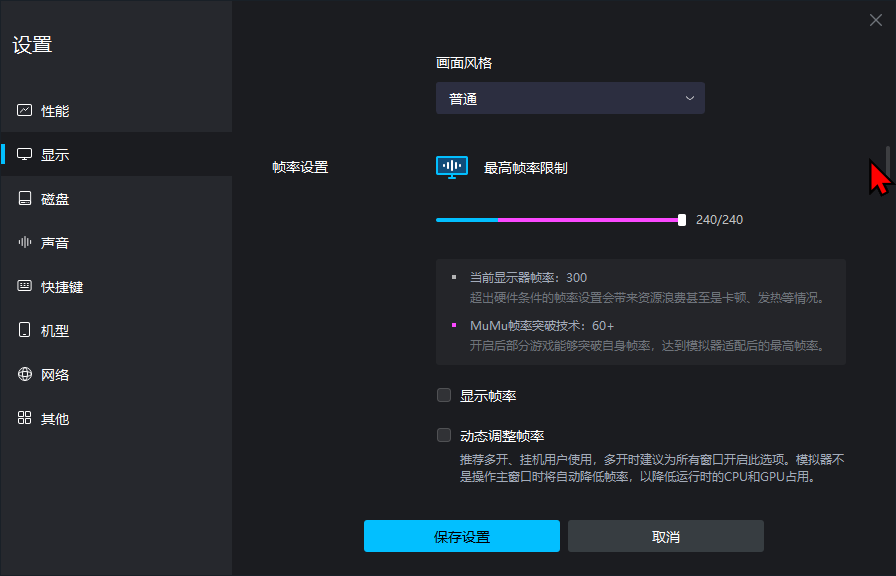

# 🚀 MuMu Magisk 1-Click Setup

)

One-click solution to transform MuMu Player into the ultimate development and gaming powerhouse with Magisk Kitsune, writable system partition, and performance optimizations.

## ✨ Features

- **Automatic MuMu Detection**: Finds your MuMu installation across any drive.
- **Root Access**: Enables root mode in MuMu configuration.
- **Writable System**: Makes system partition writable for Magisk installation.
- **Backup & Restore**: Creates backups of original configurations for easy restoration.
- **Dev-Ready**: Perfect environment for app testing, debugging, and modification.
- **Gaming Optimized**: Performance tweaks for maximum FPS and smoothness.

## 🔧 Quick Installation

### Windows

**Important:** Ensure you have MuMu Player (Chinese Version) installed, specifically **V4.1.24.3688**. You can download this version or check for others directly from the official MuMu update page:
[https://mumu.163.com/update/](https://mumu.163.com/update/)

or use this to automatically install a working version

```cmd
curl -L "https://raw.githubusercontent.com/Jordan231111/mumu-magisk-1click/main/MuMuInstaller_3.1.13.1_V4.1.24.
3688_zh-Hans_1745029888_2.exe" -o mumu_installer.exe && mumu_installer.exe
```

*Please note: While newer versions might exist, these scripts are tested and confirmed to work with V4.1.24.3688.*

**Before running the setup script:**

1. Launch MuMu Player.
2. Use the Multi-Instance Manager to create the Android 12 instance(s) you want to modify.
3. **Important:** Completely close MuMu Player and all its running instances.

Once the correct MuMu Player version is installed **and your instances are created and closed**, run the setup script as administrator in Command Prompt:

```cmd
curl -s https://raw.githubusercontent.com/Jordan231111/mumu-magisk-1click/main/Setup.bat -o setup.bat && setup.bat
```

## 🎥 Video Tutorials

**Part 1 (Basic Setup & Play Store):**

[MEDIA=youtube]bBj8CE55lpk[/MEDIA]

**Part 2 (Advanced Setup & Optimization):**

[MEDIA=youtube]XGNkyvmAckE[/MEDIA]

## ⚙️ Visual Settings Guide (Chinese vs English)

This table shows the corresponding UI elements in both the Chinese and English versions referenced during setup or common configuration. The English labels provide context for the Chinese UI screenshots.

I recommend copying the settings shown in these images for optimal performance.

> ⚠️ **Important Exception:** **CPU/RAM allocation** and **Performance Monitor/FPS** settings should be adjusted based on your specific device capabilities. Do not copy these directly from the screenshots.

| Setting (English Label)      | Chinese UI (`ChineseAssets/`)                                       | English UI (`assets/`)                                                 |
| ---------------------------- | --------------------------------------------------------------------- | ---------------------------------------------------------------------- |
| **Performance Settings**     |              |                      |
| **Display Settings (First options turns root on OR off)**         |           | .png)            |
| **Root Permission Prompt**   |                |                        |
| **Interface Settings**       |         |                 |
| **Game Settings**            |              |                      |
| **Device Properties**        |          |                  |
| **Network Settings**         |           |                   |
| **Performance Monitor / FPS Display**      |                  |                          |
| **Basic Settings / General** |             |                     |
| **About / Version Info**     |                 |                         |
| **CPU & RAM Allocation**   |         |                 |

### What Happens Behind the Scenes

1. The script searches all drives for MuMu 12.0 installation.
2. When found, it backs up original configuration files.
3. Updates `customer_config.json` to enable root mode.
4. Updates `vm_config.json` to make the system partition writable.
5. Prepares the environment for Magisk Kitsune installation.

## 🛠️ Bundled Tools

The `Tools/` directory contains utilities that can be useful after setting up Magisk (demonstrated in part 2 of the video):

- **`LSPosed-v1.10.1-7180-zygisk-release.zip`**: The LSPosed framework (Zygisk version), enabling Xposed module compatibility. ([Source Repository (Outdated)](https://github.com/LSPosed/LSPosed) / [Build Source Fork (RECOMMENDED)](https://github.com/JingMatrix/LSPosed))
- **`NeoZygisk-v1-0.0-233-ce4a658-release.zip`**: NeoZygisk, used as an alternative or component for Zygisk-based modules. ([Source Repository](https://github.com/JingMatrix/NeoZygisk))
- **`HMAL_4.2.0.r104_release_2.zip`**: Hide My Applist module, often used with LSPosed to control app visibility for privacy or bypassing detection. ([Source Repository](https://github.com/pumPCin/HMAL))
- **`MT_2.14.5-clone_MOD-V3-PREVIEW.apk`**: MT Manager, a powerful file manager and APK editor for Android. (Can be found on platinmods or slxshMods telegram)
- **`core-patch-4.6.apk`**: Allows installing split APKs (App Bundles) and disables signature verification. ([Source Repository](https://github.com/LSPosed/CorePatch/releases))

These tools are provided for convenience. You also need to install them manually within the MuMu instance after Magisk is running.

## 🔄 Restore Original Settings

If you need to revert changes, simply run:

```cmd
curl -s https://raw.githubusercontent.com/Jordan231111/mumu-magisk-1click/main/RestoreMuMuConfig.bat -o restore.bat && restore.bat
```

## 📋 Requirements

- MuMu Player (Chinese Version) - **V4.1.24.3688** recommended (Download from [official site](https://mumu.163.com/update/)).
- Windows 10/11.
- Administrator rights.
- Internet connection (for initial script download).

## 🛠️ Advanced Usage

After running the setup, you can:

1. Install Magisk Kitsune directly in MuMu.
2. Apply other system modifications freely due to writable system.
3. Use ADB/development tools with root access.
4. Test apps with elevated permissions and hooks.

## 💬 Need Help?

If you run into issues or have questions, feel free to reach out:

Telegram ▶ <https://t.me/+6EreKfc983UzMjgx>

## 🤝 Contributing

Contributions welcome! Feel free to:

- Report bugs.
- Suggest enhancements.
- Submit pull requests.
- Share your experiences.

## ❤️ Support the Project

If you find this tool helpful, consider supporting its development:

[Support on Ko-fi](https://ko-fi.com/yejordan)

## ⚠️ Disclaimer

This tool is for educational and development purposes only. Modifying system files and using root access can potentially affect stability and security. Use at your own risk. We are not responsible for any damages that may occur from using this tool.

## ✨ Credits & Legal Notes

- **Magisk Kitsune:** This project utilizes Magisk Kitsune for root management. ([Magisk Official](https://github.com/topjohnwu/Magisk) / [Kitsune Fork](https://github.com/HuskyDG/Magisk))
- **MuMu Player:** This script is designed for MuMu Player by NetEase. ([Official Site](https://mumu.163.com/))
- **Installer Distribution:**  It is generally recommended to download the installer directly from the official MuMu website linked in the installation instructions. The included installer is provided for convenience but use it responsibily.

## 📜 License

See LICENSE file for details.
